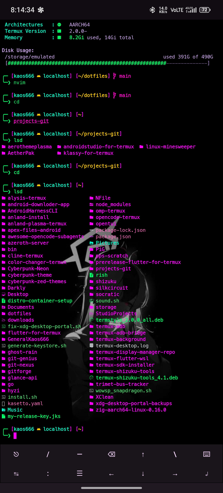
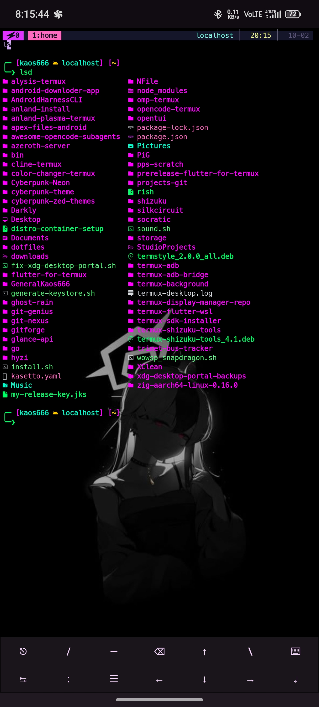
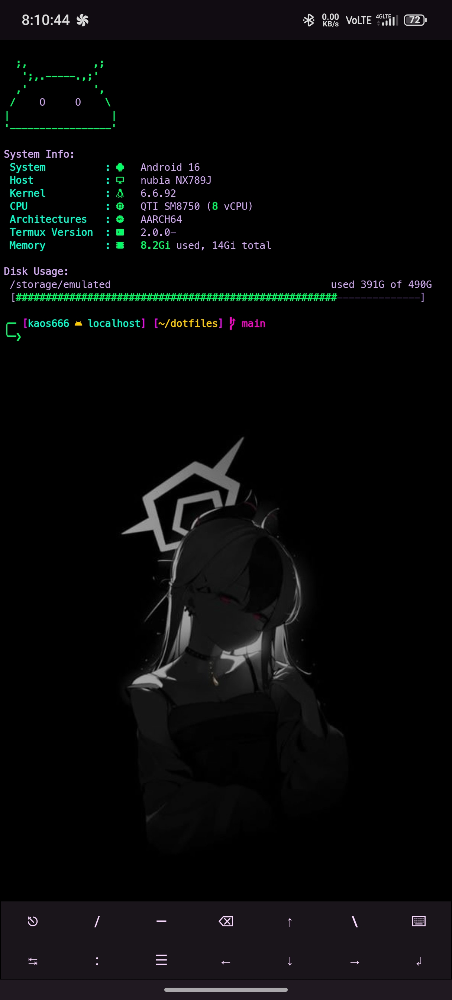
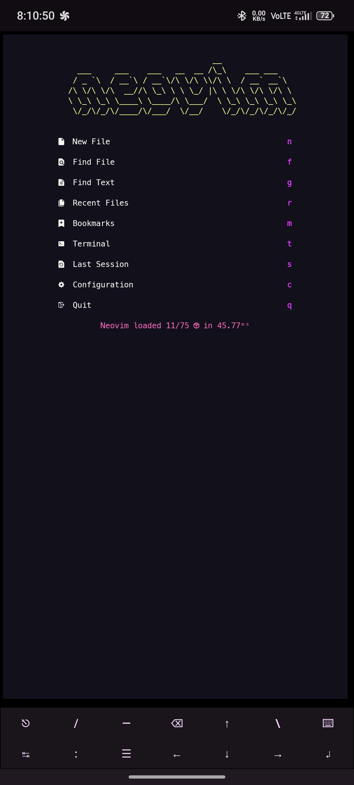
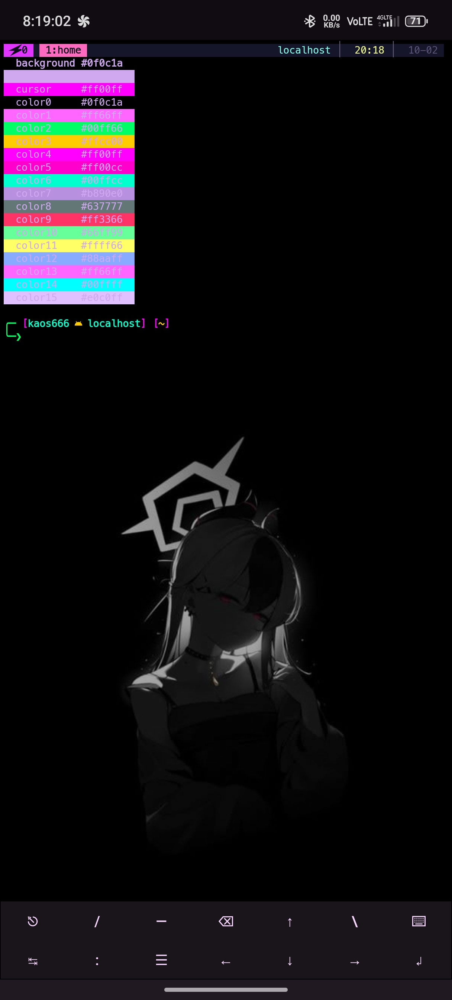

# Termux SilkCircuit Dotfiles


Neon-on-near-black Termux setup: zsh with custom `td` theme
(bash fallback), tmux, fastfetch, Neovim snapshot, SilkCircuit colors.
`install.sh` wires it up.

## Screenshots

| shell | tmux |
| --- | --- |
|  |  |

| fastfetch | nvim |
| --- | --- |
|  |  |

| palette |
| --- |
|  |

## SilkCircuit Palette (vibrant)

| Name | Hex |
| --- | --- |
| `background` | `#0f0c1a` |
| `foreground` | `#d0a8f0` |
| `cursor` | `#ff00ff` |
| `color0` | `#0f0c1a` |
| `color1` | `#ff66ff` |
| `color2` | `#00ff66` |
| `color3` | `#ffcc00` |
| `color4` | `#ff00ff` |
| `color5` | `#ff00cc` |
| `color6` | `#00ffcc` |
| `color7` | `#b890e0` |
| `color8` | `#637777` |
| `color9` | `#ff3366` |
| `color10` | `#66ff99` |
| `color11` | `#ffff66` |
| `color12` | `#88aaff` |
| `color13` | `#ff66ff` |
| `color14` | `#00ffff` |
| `color15` | `#e0c0ff` |

Exact values (from `termux/colors/silkcircuit-vibrant.properties`):

```properties
background=#0f0c1a
foreground=#d0a8f0
cursor=#ff00ff
color0=#0f0c1a
color1=#ff66ff
color2=#00ff66
color3=#ffcc00
color4=#ff00ff
color5=#ff00cc
color6=#00ffcc
color7=#b890e0
color8=#637777
color9=#ff3366
color10=#66ff99
color11=#ffff66
color12=#88aaff
color13=#ff66ff
color14=#00ffff
color15=#e0c0ff
```

`termux/colors/` holds five variants: vibrant (default), neon, glow, soft, dawn.

## Features

- zsh first (zinit, plugins, completions), bash fallback, shared aliases
- Custom `td` prompt theme, exit status in RPROMPT
- tmux config for Termux touch keyboards
- fastfetch in SilkCircuit colors
- Neovim snapshot (lazy.nvim, LSP, snippets)
- Installer moves old files aside, overwrites nothing

## Contents

| Path | Purpose |
| --- | --- |
| `shell/zsh` | Main zsh config (zinit, plugins, completions, PATH) + `td` theme |
| `shell/bash` | Bash-side config (`.bashrc`, `.bash_profile`, `.profile`) |
| `shell/shared` | Settings shared by bash and zsh (aliases, common rc) |
| `termux` | `termux.properties`, `font.ttf`, SilkCircuit color variants |
| `tmux` | tmux config (`.tmux.conf`) |
| `nvim` | Neovim config snapshot (`init.lua`, `lua/`, `snippets/`) |
| `fastfetch` | fastfetch config (`config.jsonc`) |

## Install

```sh
git clone https://github.com/GeneralKaos666/dotfiles ~/dotfiles && ~/dotfiles/install.sh
```

Restart Termux. Zinit pulls plugins on first launch.

## Termux Notes

- The installer copies `termux/font.ttf` to `~/.termux/font.ttf` and the
  vibrant variant to `~/.termux/colors.properties`. Plain copies,
  no symlinks, so theme switchers keep control.
- Apply colors/font with no restart:
  `termux-reload-settings`.
- Other variants (`neon`, `glow`, `soft`, `dawn`) sit in
  `~/dotfiles/termux/colors/`. Preview: copy one to
  `~/.termux/colors.properties`, then run `termux-reload-settings`.

## Restore

`install.sh` moves old files to a timestamped backup
directory (`~/.dotfiles.bak-*`). To undo, copy files back from the newest
backup, e.g. `cp ~/.dotfiles.bak-*/.zshrc ~/`.

## Credits

GeneralKaos666 built this. The SilkCircuit palette, `termux/colors/silkcircuit-*` files, and `fastfetch/config.jsonc` come from [SilkCircuit](https://github.com/hyperb1iss/silkcircuit) by hyperb1iss (MIT). Generator credit sits in the fastfetch config header. MIT License covers this repo. See [LICENSE](LICENSE).
